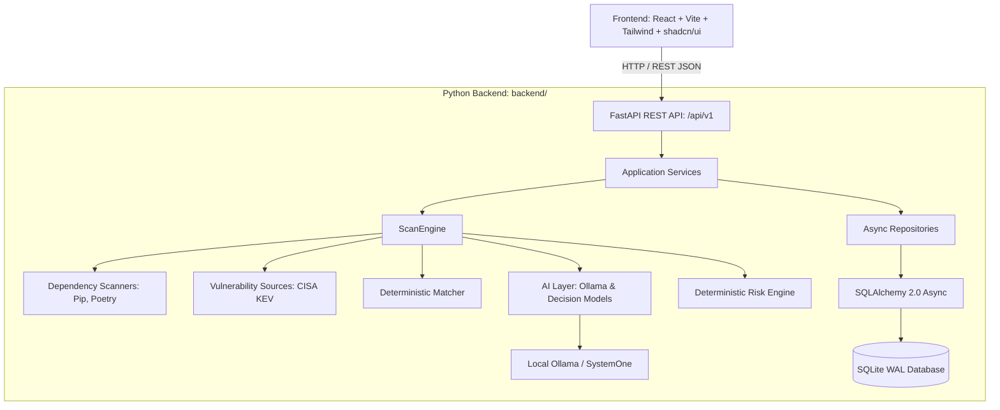

# Local Vulnerability AI — Arquitectura General del Sistema

## 1. Visión y Principios del Proyecto

**Local Vulnerability AI** es una plataforma de análisis de vulnerabilidades para proyectos de software diseñada bajo los siguientes principios:

1. **Local-first & Privacy-first**: Los análisis de dependencias, almacenamiento de datos y enriquecimiento con modelos de IA se ejecutan preferentemente en el entorno local del usuario, evitando fuga de código o metadatos sensibles.
2. **Determinismo antes que heurística**: La detección de vulnerabilidades se fundamenta en fuentes oficiales verificadas (como CISA KEV) y algoritmos de coincidencia deterministas antes de aplicar capas de análisis por IA.
3. **Separación física de responsabilidades**:
   - `backend/`: Motor en Python con FastAPI, SQLite WAL, Alembic, AI layer y Risk Engine.
   - `frontend/`: Interfaz web moderna (React + TypeScript + Vite + Tailwind CSS + shadcn/ui).
   - `docs/`: Especificaciones técnicas y contratos de arquitectura transversales.

---

## 2. Diagrama de Arquitectura de Alto Nivel

---

## 3. Componentes del Backend (`backend/`)

### 3.1 Core Engine (`vuln_ai.core`)
- **Scanners**: Detectores modulares de dependencias de proyectos (e.g. `requirements.txt`, `pyproject.toml`).
- **Sources**: Conectores sincronizados con fuentes de inteligencia de amenazas (CISA KEV con fallback a mirrors y validación de esquemas).
- **Deterministic Matcher**: Algoritmo de cruce exacto y versionado entre dependencias detectadas y vulnerabilidades conocidas en KEV.
- **ScanEngine**: Orquestador central del flujo determinista de escaneo.

### 3.2 AI Layer (`vuln_ai.ai`)
- **AIProvider & DecisionProvider**: Abstracciones desacopladas para interactuar con modelos de lenguaje locales (Ollama `/api/chat`, Ollama SystemOne `/v1/systemone`).
- **Análisis Contextual**: Enriquecimiento estructurado que evalúa el vector de ataque y la severidad contextual de cada coincidencia.

### 3.3 Risk Engine (`vuln_ai.risk`)
- **DeterministicRiskEngine**: Motor de evaluación matemática basado en reglas que pondera la presencia en CISA KEV, existencia de ransomware, exposición de red y análisis de IA para calcular el score y nivel de riesgo (LOW, MEDIUM, HIGH, CRITICAL).

### 3.4 Persistencia (`vuln_ai.db`)
- **SQLAlchemy 2.0 Async**: Modelos ORM asíncronos mapeados a SQLite en modo WAL (`aiosqlite`).
- **Repositorios**: Patrón repositorio para proyectos, escaneos, componentes, fuentes, vulnerabilidades, matches y evaluaciones.
- **Alembic**: Control de versiones de esquema y migraciones declarativas.

### 3.5 API REST (`vuln_ai.api`)
- **FastAPI**: Routers versionados bajo `/api/v1` para `projects`, `scans`, `components`, `vulnerabilities`, `sources` y `matches`.
- **Manejo de Errores**: Middleware de logging de requests, captura de excepciones globales y esquemas estandarizados.

---

## 4. Frontend (`frontend/`)

- La implementación del frontend se realiza en la **Fase 4**.
- Consumirá los endpoints REST de `/api/v1` proporcionando un dashboard de seguridad visual, escaneos interactivos, inspección de dependencias y análisis contextual de riesgo.

---

## 5. Referencias de Documentación

- [docs/api.md](file:///Users/alejandro03hl/Desktop/Local%20Vulnerability%20AI/docs/api.md): Especificación exhaustiva de endpoints y contratos REST.
- [docs/ai_and_risk_architecture.md](file:///Users/alejandro03hl/Desktop/Local%20Vulnerability%20AI/docs/ai_and_risk_architecture.md): Arquitectura de la capa de IA y motor determinista de riesgo.
- [docs/frontend.md](file:///Users/alejandro03hl/Desktop/Local%20Vulnerability%20AI/docs/frontend.md): Guía de diseño, componentes y especificación de UI para la Fase 4.
- [backend/README.md](file:///Users/alejandro03hl/Desktop/Local%20Vulnerability%20AI/backend/README.md): Guía de desarrollo, ejecución y tests del backend.
- [frontend/README.md](file:///Users/alejandro03hl/Desktop/Local%20Vulnerability%20AI/frontend/README.md): Espacio para el desarrollo del frontend en la Fase 4.
