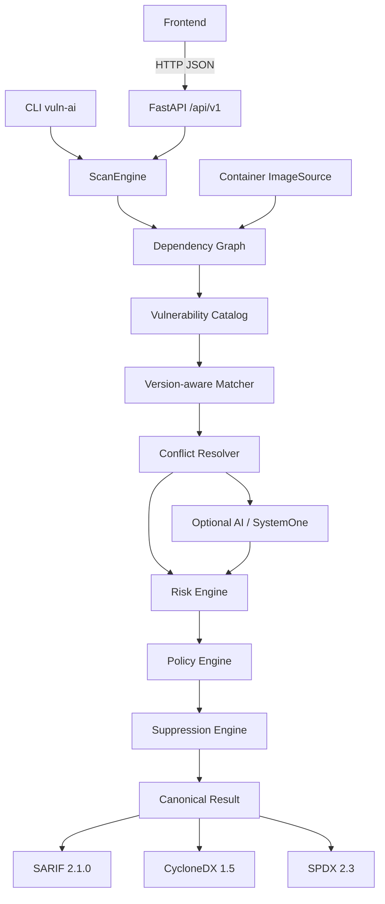

# Local Vulnerability AI — Arquitectura General del Sistema

## 1. Visión y Principios del Proyecto

**Local Vulnerability AI** es una plataforma de análisis de vulnerabilidades para proyectos de software diseñada bajo los siguientes principios:

1. **Local-first & Privacy-first**: Los análisis de dependencias, almacenamiento de datos y enriquecimiento con modelos de IA se ejecutan preferentemente en el entorno local del usuario, evitando fuga de código o metadatos sensibles.
2. **Determinismo antes que heurística**: La detección de vulnerabilidades se fundamenta en fuentes oficiales verificadas (como CISA KEV) y algoritmos de coincidencia deterministas antes de aplicar capas de análisis por IA.
3. **Separación física de responsabilidades**:
   - `backend/`: Motor en Python con FastAPI, SQLite WAL, Alembic, AI layer y Risk Engine.
   - `frontend/`: Interfaz web moderna (React + TypeScript + Vite + Tailwind CSS + shadcn/ui).
   - `docs/`: Especificaciones técnicas y contratos de arquitectura transversales.

---

## 2. Diagrama de Arquitectura de Alto Nivel

```text
CLI / API / Frontend
         │
         ↓
    Scan Engine
         ↓
 Dependency Graph  ←── Project scanners + Container/ImageSource
         ↓
 Vulnerability Catalog (OSV / NVD / CISA KEV)
         ↓
 Version-aware Matcher
         ↓
 Conflict Resolver
         ↓
   ┌─────┴─────┐
   ↓           ↓
AI (opt.)   SystemOne (opt.)
   └─────┬─────┘
         ↓
    Risk Engine
         ↓
   Policy Engine
         ↓
 Suppression Engine
         ↓
 Canonical Scan Result
         ↓
   ┌─────┼─────┐
   ↓     ↓     ↓
 SARIF CycloneDX SPDX
```



---

## 3. Componentes del Backend (`backend/`)

### 3.1 Core Engine & Matching (`vuln_ai.core`, `vuln_ai.matching`)
- **Scanners**: Detectores modulares de dependencias de proyectos (e.g. `requirements.txt`, `pyproject.toml`).
- **Sources**: Conectores sincronizados con fuentes canónicas de vulnerabilidades: CISA KEV, OSV y NVD, correlacionadas en un único catálogo canónico.
- **Version-aware Matcher**: Algoritmo determinista de cruce por ecosistema, nombre normalizado y evaluación matemática de rangos de versiones (`introduced`, `fixed`, `limit`, `last_affected`), generando `MatchEvidence` auditable.
- **ScanEngine**: Orquestador central del pipeline completo de escaneo e integración.

### 3.2 AI Layer (`vuln_ai.ai`)
- **AIProvider & DecisionProvider**: Abstracciones desacopladas para interactuar con modelos locales (Ollama `/api/chat`, Ollama SystemOne `/v1/systemone`).
- **Análisis Contextual**: Enriquecimiento no decisivo que provee contexto, narrativa y matices técnicos. Nunca decide la aplicabilidad de versiones ni el riesgo final.

### 3.3 Risk Engine (`vuln_ai.risk`)
- **DeterministicRiskEngine**: Motor determinista y auditable basado en reglas que pondera aplicabilidad de versiones, evidencia estructurada, presencia en CISA KEV, CVSS score y decisiones probabilísticas de soporte para calcular el estado y nivel de riesgo (LOW, MEDIUM, HIGH, CRITICAL).

### 3.4 Persistencia (`vuln_ai.db`)
- **SQLAlchemy 2.0 Async**: Modelos ORM asíncronos mapeados a SQLite en modo WAL (`aiosqlite`).
- **Repositorios**: Patrón repositorio para proyectos, escaneos, componentes, fuentes, vulnerabilidades, matches y evaluaciones.
- **Alembic**: Control de versiones de esquema y migraciones declarativas.

### 3.5 API REST (`vuln_ai.api`)
- **FastAPI**: Routers versionados bajo `/api/v1` para `projects`, `scans`, `components`, `vulnerabilities`, `sources` y `matches`.
- **Manejo de Errores**: Middleware de logging de requests, captura de excepciones globales y esquemas estandarizados.

---

## 4. Frontend (`frontend/`)

- La implementación del frontend se realiza en la **Fase 4**.
- Consumirá los endpoints REST de `/api/v1` proporcionando un dashboard de seguridad visual, escaneos interactivos, inspección de dependencias y análisis contextual de riesgo.

---

---

## 6. Multi-Source Intelligence — OSV Adapter & Canonical Normalization

En la Fase 5, el sistema evoluciona hacia una arquitectura multi-fuente unificada bajo un modelo canónico de vulnerabilidades:

```text
OSV API (api.osv.dev/v1)
        ↓
   OSV Adapter (OSVSource)
        ↓
  Normalization Layer
        ↓
Canonical Vulnerability (VulnerabilityRecord)
 ├── Identifiers (CVE, GHSA, OSV, PYSEC, ALIAS)
 ├── Source Record (OSV evidence, raw_payload, timestamps)
 └── Affected Ranges (ecosystem, package, introduced, fixed, limit)
        ↓
VulnerabilityRepository (Async persistence, idempotency)
```

### Principios del Adapter OSV:
1. **OSV como Fuente**: OSV (*Open Source Vulnerabilities*) es una fuente de evidencia distribuida por paquete y ecosistema; **no es la autoridad final** del Risk Engine ni sustituye al catálogo interno.
2. **Independencia del Dominio**: El dominio interno (`VulnerabilityRecord`, `VulnerabilityDB`) permanece desacoplado de las particularidades del schema de OSV.
3. **Selección Determinista de `canonical_id`**: Prioriza formalmente identificadores universales:
   - 1. CVE (`CVE-YYYY-NNNN+`) si está presente en `id` o `aliases`.
   - 2. GHSA (`GHSA-...`) si no existe CVE.
   - 3. ID nativo de OSV (`PYSEC-...`, `GO-...`, `OSV-...`).
   - Todos los identificadores y alias se preservan sin pérdida en `vulnerability_identifiers`.
4. **Preservación de Rangos Afectados (`vulnerability_affected_ranges`)**: Se normalizan campos estructurados (`introduced`, `fixed`, `last_affected`, `limit`, `raw_range`, `range_type`) para los ecosistemas soportados (PyPI, npm, Go, Cargo/crates.io). **En esta etapa el version-matcher todavía no interpreta los rangos**.
5. **Auditoría y Evidencia**: Cada registro persistido genera un `VulnerabilitySourceRecord` donde `raw_payload` conserva el JSON original completo para auditoría forense y trazabilidad reproducible.

---

## 7. Multi-Source Intelligence — NVD Adapter & CPE vs Package Ranges

En la Etapa 5, el sistema incorpora el National Vulnerability Database (NVD API 2.0) como tercera fuente de inteligencia canónica:

```text
NVD API (services.nvd.nist.gov/rest/json/cves/2.0)
        ↓
   NVD Adapter (NVDSource)
        ↓
  Normalization Layer
        ↓
Canonical Vulnerability (VulnerabilityRecord)
 ├── Identifiers (CVE-YYYY-NNNN, aliases)
 ├── Source Record (NVD evidence, raw_payload, timestamps)
 └── Affected Ranges (Safe package ranges ONLY)
        ↓
VulnerabilityRepository (Async persistence, multi-source deduplication)
```

### Principios y Reglas Críticas del Adapter NVD:
1. **CPE NO equivale automáticamente a package ecosystem**:
   - NVD modela productos y plataformas mediante **CPE 2.3** (`cpe:2.3:a:vendor:product:version:...`) y árboles lógicos de configuración.
   - **Bajo ninguna circunstancia** un CPE genérico de software (e.g. `cpe:2.3:a:apache:http_server:...` o `cpe:2.3:a:microsoft:windows:...`) se transforma arbitrariamente en paquetes de PyPI, npm o Cargo.
   - Solo se generan filas en `vulnerability_affected_ranges` cuando existe una correspondencia explícita y validada de ecosistema (por ejemplo, `target_sw` es `python`, `node.js`, `golang` o `cargo`).
2. **Preservación de Evidencias Sin Rango**:
   - Cuando una configuración de NVD no puede convertirse de forma segura en un rango de paquete, **NO se inventa un rango**.
   - Toda la información original de configuraciones, CPE matches, matchCriteriaId y version constraints se conserva íntegramente en el campo `raw_payload` de `VulnerabilitySourceRecordDB`.
3. **Métricas CVSS y Debilidades CWE**:
   - Se extraen de forma determinista las métricas oficiales (CVSS v4.0, v3.1, v3.0, v2.0) registrando `severity` y `cvss_score` sin inventar puntajes.
   - Los identificadores de debilidades se normalizan hacia `cwes` (`CWE-89`, `CWE-79`), descartando marcadores no informativos (`NVD-CWE-noinfo`).
4. **Deduplicación Canónica**:
   - Los registros de NVD se integran al mismo `VulnerabilityDB` existente si OSV o CISA KEV ya registraron el CVE correspondiente, preservando el UUID interno y anexando el nuevo `VulnerabilitySourceRecord`.

---

## 8. Multi-Source Intelligence — CISA KEV Adapter & Active Exploitation Evidence

En la Etapa 6, el adapter de **CISA KEV** (*Known Exploited Vulnerabilities*) queda completamente integrado al modelo canónico multi-source:

```text
CISA KEV Catalog (cisa.gov KEV Feed)
        ↓
   CISA KEV Adapter (CISAKEVSource)
        ↓
  Normalization Layer
        ↓
Canonical Vulnerability (VulnerabilityRecord)
 ├── Identifiers (CVE-YYYY-NNNN, source="CISA KEV")
 ├── Source Record (CISA KEV, has_kev_evidence=True, raw_payload)
 └── Affected Ranges = [] (Zero synthetic package ranges)
        ↓
VulnerabilityRepository (Async persistence, idempotency, multi-source reconciliation)
```

### Principios y Reglas Críticas del Adapter CISA KEV:

1. **CISA KEV como Evidencia de Explotación Activa**:
   - CISA KEV aporta evidencia de que una vulnerabilidad (CVE) está siendo activamente explotada en incidentes reales o campañas de ransomware.
   - Genera un `VulnerabilitySourceRecord` con `has_kev_evidence = True` y `has_affected_range = False`.

2. **CISA KEV NO proporciona rangos afectados de paquetes autoritativos**:
   - *CISA KEV does not provide authoritative package affected ranges.*
   - El catálogo de CISA KEV únicamente especifica `vendorProject` y `product` (e.g. `Apache HTTP Server`, `Fortinet FortiMail`, `Django`).
   - **Bajo ninguna circunstancia** se inventan rangos de versiones de paquetes (e.g. PyPI, npm, Cargo) a partir de los nombres de producto de CISA.
   - El adapter siempre establece `affected_ranges = []`.

3. **Presencia en CISA KEV ≠ Versión Instalada Afectada**:
   - *CISA presence ≠ installed version affected.*
   - La inclusión de un CVE en KEV demuestra que el fallo es peligroso y explotado activamente, pero **no demuestra por sí misma que una versión concreta instalada en el proyecto sea vulnerable**.
   - La verificación de afectación de versiones específicas sigue dependiendo de los rangos estructurados provistos por OSV y NVD, y del futuro Version-Aware Matcher.

4. **Preservación Integral de la Evidencia CISA**:
   - Se conservan de forma estructurada los campos: `cveID` (canonical y cve_id), `vendorProject`, `product`, `vulnerabilityName`, `dateAdded`, `dueDate`, `requiredAction`, `knownRansomwareCampaignUse`, `cwes` y `notes`.
   - La propiedad `knownRansomwareCampaignUse` se conserva como evidencia sin forzar automáticamente `RiskLevel.CRITICAL` ni un estado ficticio de `VULNERABLE`.
   - La fecha límite `dueDate` no se transforma arbitrariamente en un urgency score.
   - El payload original JSON completo se almacena en `raw_payload` para auditoría y trazabilidad.

5. **Reconciliación y Deduplicación Multi-Source (OSV ↔ NVD ↔ CISA KEV)**:
   - Cuando un CVE es reportado conjuntamente por OSV, NVD y CISA KEV, el repositorio garantiza:
     - Un único identificador canónico interno (UUID).
     - Conservación de todos los alias (`CVE-YYYY-NNNN`, `GHSA-...`).
     - Conservación de los 3 registros de procedencia (`VulnerabilitySourceRecord`).
     - Conservación íntegra de los `vulnerability_affected_ranges` provenientes de OSV.
     - Conservación del score CVSS y debilidades CWE provenientes de NVD.
     - Conservación de la evidencia de explotación KEV y campos de remediación de CISA.

---

## 9. Multi-Source Conflict Resolution (`vuln_ai.matching.conflict`)

En la Etapa 9, el sistema formaliza la resolución auditable, determinista y desacoplada de discrepancias provenientes de múltiples fuentes de inteligencia (OSV, NVD, CISA KEV).

```text
Source (OSV, NVD, CISA KEV)
       ↓
Normalized Vulnerability (VulnerabilityRecord)
       ↓
AffectedVersionRange (Structured range bounds)
       ↓
Version-aware Matcher (Per-ecosystem range math)
       ↓
Individual MatchEvidence (Preserved audit trail)
       ↓
Conflict Resolver (Deterministic disambiguation)
       ↓
Consolidated Applicability (LIKELY_AFFECTED, REQUIRES_REVIEW, etc.)
       ↓
Deterministic Risk Engine (RiskAssessment with explicit rule trace)
```

### 9.1 Evidencia Complementaria vs Conflicto Real

1. **Evidencia Complementaria (`COMPLEMENTARY`)**:
   - Ocurre cuando distintas fuentes aportan información sobre diferentes dimensiones técnicas de la vulnerabilidad sin contradecirse.
   - Ejemplo:
     - OSV: rango afectado `>=1.0.0, <2.0.0`
     - NVD: severidad `HIGH` / CVSS `8.2`
     - CISA KEV: explotación activa confirmada (`has_kev_evidence = True`)
   - Resultado: No existe conflicto de aplicabilidad. Las señales enriquecen holísticamente el hallazgo sin alterar la evaluación matemática de la versión.

2. **Conflicto Real (`CONFLICTING`)**:
   - Ocurre cuando dos fuentes evalúan la misma dimensión técnica (especialmente aplicabilidad sobre una versión instalada) y arrojan conclusiones incompatibles.
   - Ejemplo:
     - OSV declara rango afectado `<2.0.0` (para versión instalada `2.0.5` → `OUTSIDE` → `LIKELY_NOT_AFFECTED`).
     - NVD declara rango afectado `<2.1.0` (para versión instalada `2.0.5` → `WITHIN` → `LIKELY_AFFECTED`).
   - Resultado: Conflicto formal de aplicabilidad. El `ConflictResolver` consolida la aplicabilidad como `REQUIRES_REVIEW`, activa `conflict_detected = True`, y genera un registro persistente `SourceConflict` con severidad `HIGH`.

### 9.2 Reglas Arquitectónicas y Principios de Decisión

- **Matcher NO resuelve conflictos**: El `Version-aware Matcher` sólo responde *"¿Qué dice esta evidencia individual sobre esta versión?"*. El `ConflictResolver` es la única autoridad que responde *"¿Cómo deben interpretarse conjuntamente las evidencias de distintas fuentes?"*.
- **Preservación estricta de evidencias**: Las instancias originales de `MatchEvidence` jamás se sobreescriben ni mutan.
- **Sin autoridad mágica**: Ninguna fuente (OSV, NVD o CISA) se asume arbitrariamente como la verdad absoluta. Los desacuerdos quedan expuestos de forma auditable.
- **Determinismo estricto**: La resolución no emplea modelos LLM, SystemOne ni votaciones probabilísticas. Misma entrada garantiza siempre exactamente la misma conclusión.
- **KEV no falsifica aplicabilidad**: La presencia de un CVE en CISA KEV no transforma mágicamente una versión no afectada (`LIKELY_NOT_AFFECTED`) en afectada. KEV eleva el nivel de riesgo o urgencia de remediación, pero respeta la verdad del rango de versiones.


