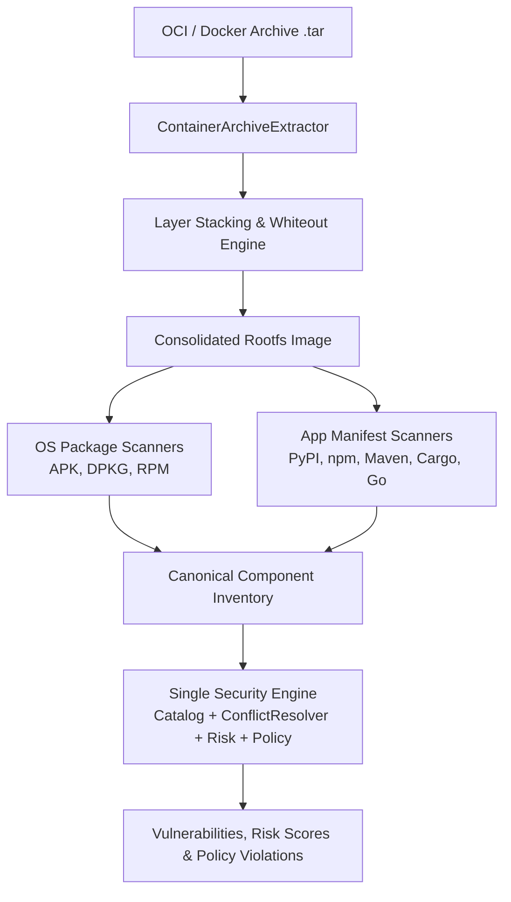

# Container & Image Scanning Engine (Etapa 17)

## 1. Overview & Architecture

The **Container & Image Scanning Engine** provides complete static vulnerability inspection for container images (Docker / OCI archives) and Dockerfiles.

### The Single Security Engine Axiom
Container security does not introduce a duplicate or parallel vulnerability engine. Instead, container layers are statically unpacked, OS and application packages are extracted into canonical `Component` models, and they are evaluated through the **exact same pipeline**:
1. **Catalog Matching**: Exact & semver/rpm/deb/apk range matching against OSV, NVD, KEV, EPSS.
2. **Conflict Resolution**: Cross-source discrepancy resolution (e.g. OSV vs NVD range discrepancies).
3. **Deterministic Risk Assessment**: Multi-source certainty, severity, and exploitation calculation.
4. **Policy Enforcement**: Declarative `.vuln-ai.yaml` threshold rules and suppressions.
5. **Report & Export Generation**: SARIF, JSON, CycloneDX, SPDX, CSV, and Markdown.



---


## ImageSource Abstraction

Acquisition is separated from inspection:

```text
ImageSource
├── LocalOCIArchiveSource   # implemented (static .tar)
├── DockerDaemonSource      # reserved / not implemented
└── OCIRegistrySource       # reserved / not implemented
```

Etapa 17 scans local Docker/OCI archives only. Daemon and registry sources remain placeholders and must never store credentials in SQLite.

## 2. Zero-Execution Security Guarantee

A foundational principle of `Local Vulnerability AI`:
> **Zero-Execution Guarantee:** Container scanning is 100% static inspection. Under no circumstances does `vuln-ai` invoke `docker run`, `docker exec`, `docker build`, `podman run`, shell wrappers, entrypoints, or workload code.

- **No Docker Daemon Required:** Images are inspected directly from saved archives (`.tar`) using pure Python file, tar, and database readers.
- **Rootless & Isolated:** Does not require root privileges or access to `/var/run/docker.sock`.
- **Safe Evaluation of Untrusted Images:** Even malicious images containing Trojan entrypoints or weaponized binaries are safely disassembled without running untrusted code.

---

## 3. Layer Extraction & OCI/Docker Specification

### Archive Format Support
The extractor automatically parses both standard formats:
1. **Docker Image Manifest v1 / v1.2 / v2**: `manifest.json` referencing layer tarballs and config JSON.
2. **OCI Image Specification v1**: `index.json` / `oci-layout` pointing to descriptor blobs and manifests.

### Layer Stacking & Whiteouts
Container filesystems are constructed by applying layers sequentially in index order (`0, 1, 2, ... N`).
- **Standard Whiteouts (`.wh.<filename>`)**: When a layer creates a file prefixed by `.wh.`, the engine marks the underlying file from previous layers as deleted in the unified view.
- **Opaque Whiteouts (`.wh..wh..opq`)**: When an opaque whiteout is detected, all files in that directory from previous layers are shadowed/removed.

---

## 4. Operating System Package Discovery

The container engine features native static parsers for the primary container Linux distributions:

| Linux Family | Filesystem Metadata Source | Format / Parser |
| :--- | :--- | :--- |
| **Alpine Linux** | `/lib/apk/db/installed` | Key-value stanza parser (`P:pkg`, `V:ver`, `A:arch`) |
| **Debian / Ubuntu** | `/var/lib/dpkg/status` | Debian control stanza parser (`Package`, `Version`, `Status: install ok installed`) |
| **RHEL / CentOS / Fedora / Rocky** | `/var/lib/rpm/Packages` or `/var/lib/rpm/rpmdb.sqlite` | Berkley DB & SQLite RPM header parser |

All extracted OS packages are tagged with:
- `component_type`: `os_package`
- `layer_digest`: Digest of the immutable layer introducing or modifying the package.
- `package_type`: `apk`, `deb`, or `rpm`.

---

## 5. Application Package Discovery

Container images frequently package applications into subdirectories (e.g., `/app`, `/usr/src/app`, `/opt/project`).
During rootfs inspection, the engine recursively searches for known application dependency manifests:
- **Python**: `requirements.txt`, `pyproject.toml`, `Pipfile.lock`, `poetry.lock`
- **JavaScript / Node.js**: `package.json`, `package-lock.json`, `yarn.lock`, `pnpm-lock.yaml`
- **Java / JVM**: `pom.xml`, `build.gradle`
- **Rust**: `Cargo.lock`
- **Go**: `go.mod`

Each manifest directory is statically passed through the corresponding ecosystem scanner, mapping installed libraries directly into the container dependency topology.

---

## 6. CLI Usage

### Scanning a Container Archive
```bash
# Scan a local Docker or OCI tar archive
vuln-ai image scan /path/to/app-container.tar

# Specify reference name and custom security policy
vuln-ai image scan /path/to/app-container.tar --reference "myorg/api:2.1.0" --policy /path/to/.vuln-ai.yaml

# Export findings to SARIF for CI/CD integration
vuln-ai image scan /path/to/app-container.tar --format sarif --output container-scan.sarif

# Run in offline/deterministic mode without generative AI
vuln-ai image scan /path/to/app-container.tar --no-ai
```

### Inspecting Image Metadata
```bash
# List all previously scanned container images
vuln-ai image list

# Show detailed breakdown of layers, OS packages, and vulnerabilities
vuln-ai image info <IMAGE_ID_OR_DIGEST>
```

---

## 7. REST API Endpoints

| Method | Endpoint | Description |
| :--- | :--- | :--- |
| `GET` | `/api/v1/images` | List scanned container images (paginated) |
| `POST` | `/api/v1/images/scan` | Trigger static container image archive scan |
| `GET` | `/api/v1/images/{id}` | Retrieve image metadata and summary |
| `GET` | `/api/v1/images/{id}/layers` | List filesystem layers, sizes, digests, and commands |
| `GET` | `/api/v1/images/{id}/components` | Get all detected OS and application packages |
| `GET` | `/api/v1/images/{id}/vulnerabilities`| Get correlated vulnerability matches |
| `GET` | `/api/v1/images/{id}/policy` | Evaluate policy thresholds and rules against image findings |
| `GET` | `/api/v1/images/{id}/dependency-graph`| Topological tree of base image, OS, and app packages |
