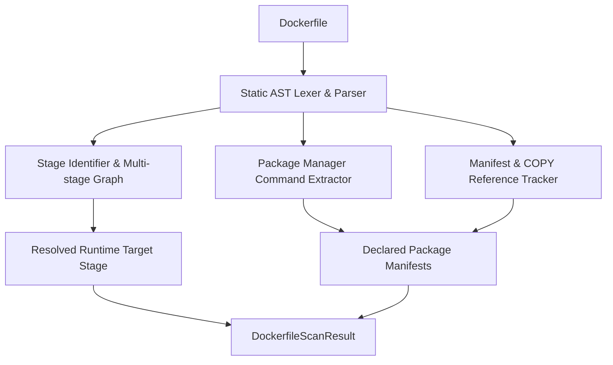

# Static Dockerfile AST Analysis (Etapa 17)

## 1. Overview

The **Dockerfile Scanner** provides static, AST-level inspection of Dockerfiles **before** building container images. It analyzes build instructions, identifies multi-stage relationships, and flags package manager invocations and dependency manifest references without invoking `docker build`.



---

## 2. Key Capabilities

### Multi-Stage Build Resolution
In modern container development, multi-stage Dockerfiles define intermediate builder stages that are discarded in production.
- **Stage Tracking**: Parses each `FROM <image> AS <stage_name>` instruction.
- **Runtime Stage Identification**: Automatically detects the final stage that produces the runtime image, or tracks intermediate stages when targeted via `--target`.
- **Base Image Audit**: Extracts base images, tags, registries, and digests used in every stage.

### Static Package Manager Command Detection
Extracts software packages installed via shell commands during build time across major package ecosystems:
- **Debian / Ubuntu**: `RUN apt-get update && apt-get install -y <packages>`
- **Alpine Linux**: `RUN apk add --no-cache <packages>`
- **RHEL / Fedora / CentOS**: `RUN dnf install -y <packages>` or `RUN yum install -y <packages>`
- **Python**: `RUN pip install <packages>`
- **Node.js**: `RUN npm install <packages>` or `RUN yarn add <packages>`

### Dependency Manifest Tracking
Detects instructions copying software manifests from the host into the container filesystem:
- `COPY package.json package-lock.json ./`
- `ADD requirements.txt /app/`
- `COPY Cargo.toml Cargo.lock ./`

---

## 3. CLI Usage

```bash
# Scan a local Dockerfile
vuln-ai image scan Dockerfile

# Scan with custom output format
vuln-ai image scan ./deploy/Dockerfile.prod --format json
```

### Example CLI Output
```
Analyzing Dockerfile: Dockerfile
------------------------------------------------------------
Multi-stage build: YES (2 stages detected)
  [Stage 0] 'builder' (Base: golang:1.21-alpine)
  [Stage 1] 'runtime' (Base: alpine:3.18) [RUNTIME TARGET]

Package Manager Invocations:
  - [apk] ca-certificates tzdata curl (line 12)

Dependency Manifests Referenced:
  - go.mod
  - go.sum
------------------------------------------------------------
```

---

## 4. REST API Endpoint

### `POST /api/v1/container/dockerfile/scan`

#### Request Payload
You can provide either raw Dockerfile text content or a local filesystem path:
```json
{
  "content": "FROM alpine:3.18 AS runtime\nRUN apk add --no-cache curl ca-certificates\nENTRYPOINT [\"/bin/sh\"]",
  "path": "/workspace/Dockerfile"
}
```

#### Response Payload (`DockerfileScanResult`)
```json
{
  "source_file": "/workspace/Dockerfile",
  "stages": [
    {
      "index": 0,
      "name": "runtime",
      "base_image": "alpine:3.18",
      "is_runtime": true
    }
  ],
  "base_images": [
    {
      "registry": null,
      "repository": "alpine",
      "tag": "3.18",
      "digest": null,
      "stage_alias": "runtime",
      "line_number": 1
    }
  ],
  "package_installations": [
    {
      "manager": "apk",
      "packages": "curl ca-certificates",
      "line": 2
    }
  ],
  "copied_files": [],
  "dependency_manifests": []
}
```
