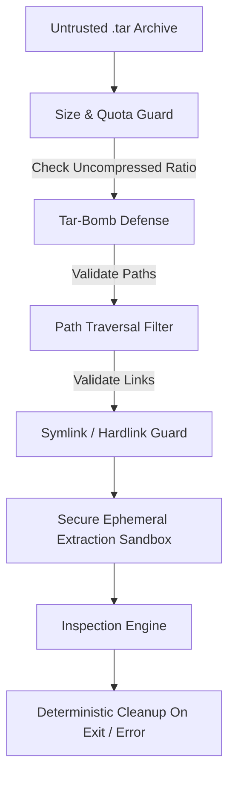

# Container Archive Security & Defenses (Etapa 17)

## 1. Threat Model & Secure Extraction Architecture

Container image archives are untrusted archives supplied from developers, registries, CI pipelines, or third-party vendors. When unpacking `.tar` files, vulnerability scanners are susceptible to malicious payload manipulation, resource exhaustion, and sandbox escape.

`Local Vulnerability AI` implements defense-in-depth protections during container image extraction:



---

## 2. Security Controls & Protections

### 1. Zero Workload Execution Guarantee
- **No Binary Invocation:** The scanner never executes binaries present in the container image (`/bin/sh`, `/bin/bash`, custom entrypoints, ELF binaries).
- **No Container Engine Daemon Dependency:** The scanner does not connect to Docker or Podman sockets or spawn child daemon processes. Pure Python static parsing eliminates daemon escape or root privilege escalation vectors.

### 2. Tar-Bomb & Resource Exhaustion Defense
- **Decompression Ratio Enforcement:** Rejects archives whose uncompressed volume exceeds reasonable safety ratios (protecting against tiny compressed archives exploding to terabytes).
- **Layer & File Limits:**
  - Maximum layer count cap (e.g. 128 layers).
  - Maximum extracted filesystem size quota (configurable, default 10 GB).
  - Maximum file entry count (default 500,000 files).
- Exceeding any threshold terminates extraction immediately with exit code 2/3 and deletes all partial artifacts.

### 3. Path Traversal & Escape Prevention (`Zip Slip` / `Tar Slip`)
- **Canonical Path Resolution:** Every member path in the tar archive is resolved using `os.path.abspath(os.path.join(sandbox_dir, member_path))` and verified with:
  ```python
  if not resolved_path.startswith(sandbox_dir_canonical):
      raise SecurityException("Path traversal attempt detected")
  ```
- **Absolute & Relative Directory Stripping:** Paths containing `../`, leading slashes `/etc/shadow`, or null bytes are rejected.

### 4. Symlink & Hardlink Validation
- **Symlink Dereferencing Containment:** Symlinks pointing outside the extraction rootfs sandbox are forbidden and ignored.
- **Link Loops & Recursive Links:** Symlink chain depth is strictly capped to prevent recursion lockups.

### 5. Secure Ephemeral Directory Lifecycle
- Extracted layers reside in restricted temporary directories (`tempfile.mkdtemp` with `0700` permissions).
- Extraction contexts are managed via Python context managers (`try...finally`) ensuring all temporary disk files are purged upon scan completion, even in the event of unhandled exceptions or user interrupts (`SIGINT`/`SIGTERM`).
